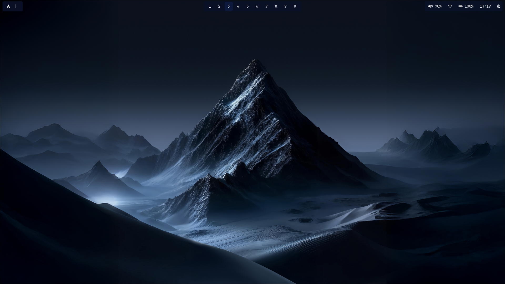

# AetherRice

AetherRice is a curated set of Wayland/Hyprland desktop configurations, utilities, and helper scripts
to provision a polished, lightweight desktop environment. It includes configurations for Hyprland, Waybar,
kitty, rofi, and helper scripts to install and bootstrap an Arch-based system.

**Contents**

- **Overview**: purpose and what is included
- **Demo**: screenshot and visual examples
- **Prerequisites**: required OS/environment and recommended packages
- **Installation**: automated (Arch) and manual instructions
- **Configuration & customization**: where to find and change settings
- **Backup & restore**: how to save your current configs
- **Troubleshooting**: tips for common issues

**Demo screenshot**




**Overview**

This repository provides:

- Opinionated Hyprland configuration and decorations (in `configs/hypr/`).
- Waybar, rofi, and kitty configuration files (in `configs/waybar/`, `configs/rofi/`, `configs/kitty/`).
- Helper scripts to install packages and copy configs to `~/.config` (`scripts/install.sh`, `setup.sh`).
- Utilities for backing up and restoring configs (`scripts/backup-configs.sh`).


**Prerequisites**

- A Linux distribution running Wayland (this project targets Arch Linux by default).
- A compatible compositor (Hyprland is used in these configs).
- Basic command-line tools: `git`, `bash`, and `sudo`.

Recommended packages (Arch): the included installer `scripts/install.sh` installs the following packages:

```
hyprland
waybar
rofi-wayland
kitty
dunst
polkit-kde-agent
xdg-desktop-portal-hyprland
qt5-wayland
qt6-wayland
pipewire
wireplumber
pipewire-pulse
sddm
ttf-jetbrains-mono-nerd
brightnessctl
git
base-devel
grim
slurp
starship
fish
fastfetch
...
```

Note: `scripts/install.sh` is written for Arch Linux and will exit if it detects a non-Arch system. See the installation section below for alternative/manual instructions on other distributions.

**Installation (Quick)**

1. Clone the repository:

```bash
git clone https://github.com/MaunyeTA/AetherRice.git
cd AetherRice
```

2. Automated (Arch Linux): run the top-level setup which calls `setup.sh` which will insatll the required packages and copies configs into `~/.config`:

```bash
bash setup.sh
```

This script will attempt to install required packages (using `pacman`) and copy configuration files into `~/.config`.

3. Manual installation (all distributions):

- Install a Wayland compositor (Hyprland or your preferred compositor) and required packages for your distro.
- Create the config directories if they do not exist:

```bash
mkdir -p ~/.config/hypr ~/.config/waybar ~/.config/rofi ~/.config/kitty
```

- Copy the configuration files from this repo into your `~/.config`:

```bash
cp -r configs/hypr ~/.config/hypr
cp -r configs/waybar ~/.config/waybar
cp -r configs/rofi ~/.config/rofi
cp -r configs/kitty ~/.config/kitty
cp -r assets ~/.config/aetherrice-assets
```

Adjust permissions as needed and restart your session or reboot.

**Files of Interest**

- `setup.sh` — top-level orchestrator that runs `scripts/install.sh` and copies files into `~/.config`.
- `scripts/install.sh` — Arch-specific package installer (see the file for the exact package list).
- `scripts/backup-configs.sh` — helper to backup current config files.
- `configs/` — directory containing all dotfiles and configs used by this setup.

**Customization**

- Edit the Hyprland config files under `configs/hypr/` to change keybindings, layouts, and decorations.
- Modify Waybar modules in `configs/waybar/` (JSON/CSS) to add or remove widgets.
- Change terminal settings in `configs/kitty/kitty.conf`.

After editing any config, reload the compositor or relevant service. For Hyprland you can run:

```bash
hyprctl reload
```

**Backup & Restore**

Use the provided backup script to save existing configurations before applying this setup:

```bash
bash scripts/backup-configs.sh
```

Restore by copying the backed-up files from the backup directory into `~/.config`.

**Troubleshooting**

- If `setup.sh` or `scripts/install.sh` fails on a non-Arch system, run the manual install steps and install distro-equivalent packages.
- If fonts or icons are missing, ensure Nerd Fonts (e.g., `ttf-jetbrains-mono-nerd`) are installed and the terminal/font cache is refreshed.
- If Wayland apps appear blurry, check `QT_QUICK_CONTROLS_STYLE` and `GDK_SCALE`/`QT_SCALE_FACTOR` environment variables for scaling issues.

**Contributing**

Contributions are welcome. Open an issue to discuss changes, or submit a PR with config improvements. When contributing, prefer small, focused changes and include screenshots where relevant.

**License**

See the `LICENSE` file for license details.

----
